# CosmoX Space Research Website on AWS EC2

AWS EC2 Ubuntu Apache website deployment project.

## Technologies Used
- AWS EC2
- Ubuntu Linux
- Apache2
- HTML
- CSS
- JavaScript

## Project Workflow
1. Created Ubuntu EC2 instance on AWS
2. Configured Security Groups for HTTP, HTTPS and SSH
3. Connected to EC2 using EC2 Instance Connect
4. Installed and started Apache2 web server
5. Uploaded website files to `/var/www/html`
6. Hosted the website using public IP

## Features
- Space-themed responsive website
- Multiple sections and pages
- Apache web server deployment
- Real AWS cloud hosting

## Note
This project uses a downloaded website template which was customized and deployed for learning and cloud hosting practice.

## Deployment Screenshots

### VS Code Project
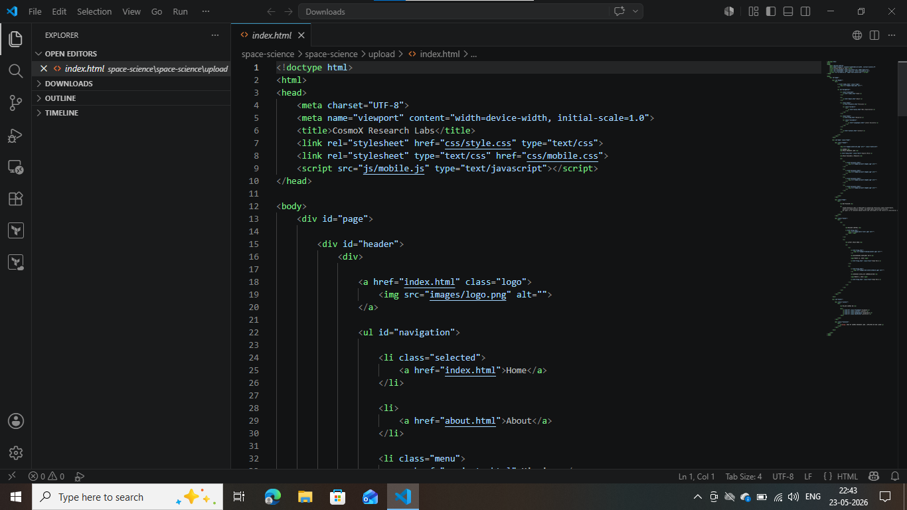

### AWS EC2 Instance Launch
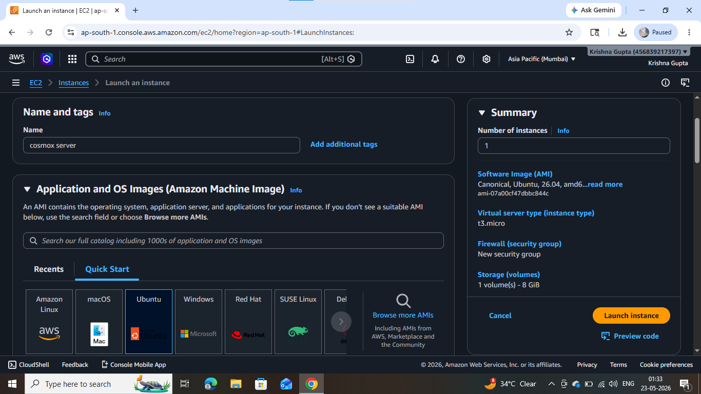

### Key Pair and Instance Type
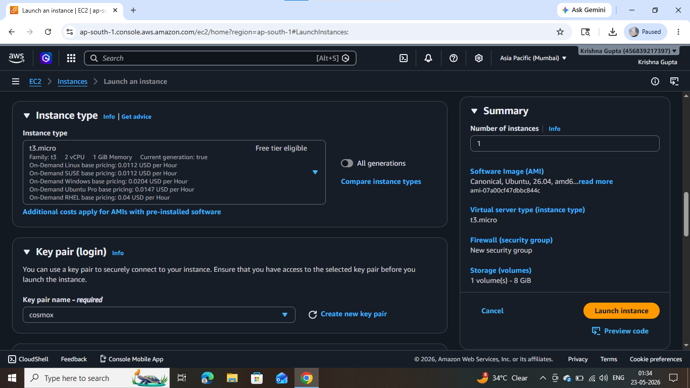

### Security Group Configuration
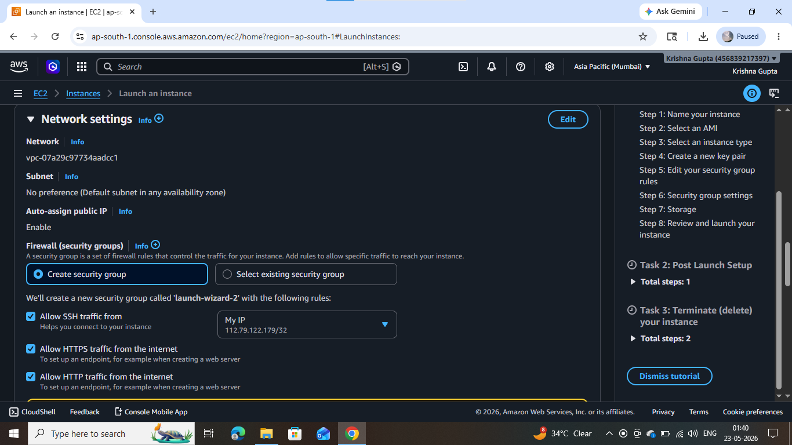

### EC2 Instance Connect
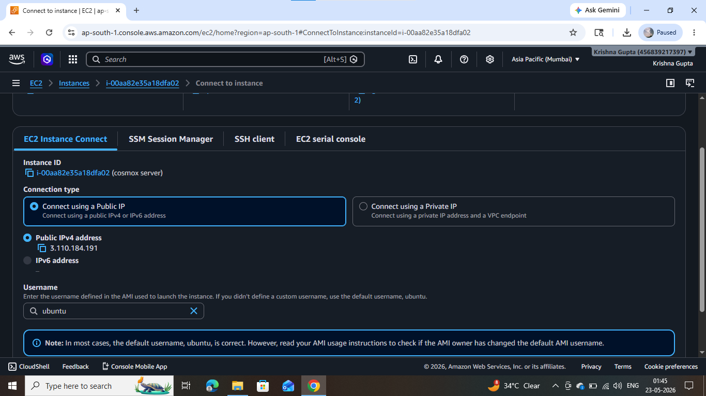

### Ubuntu Terminal Access
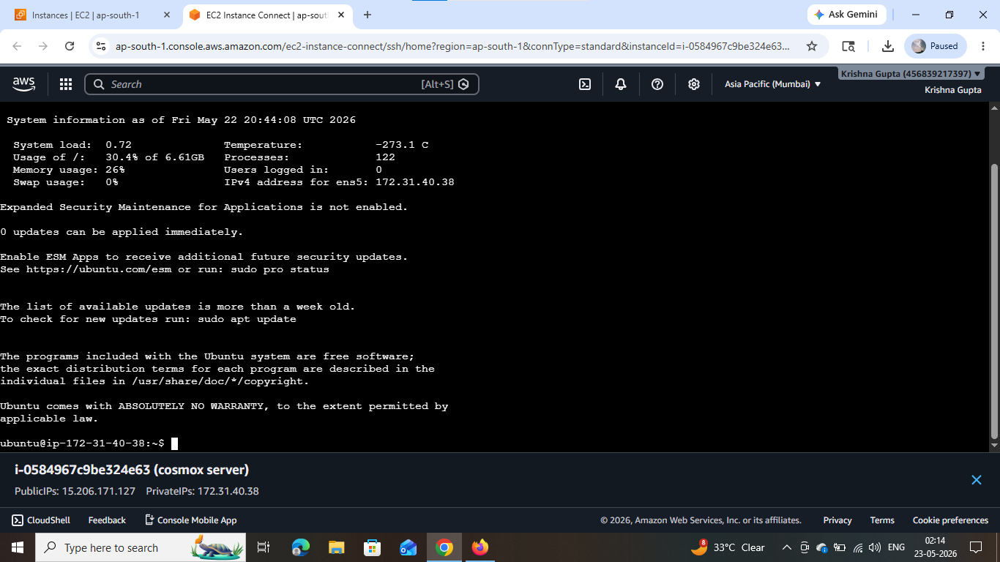

### Apache2 Service Status
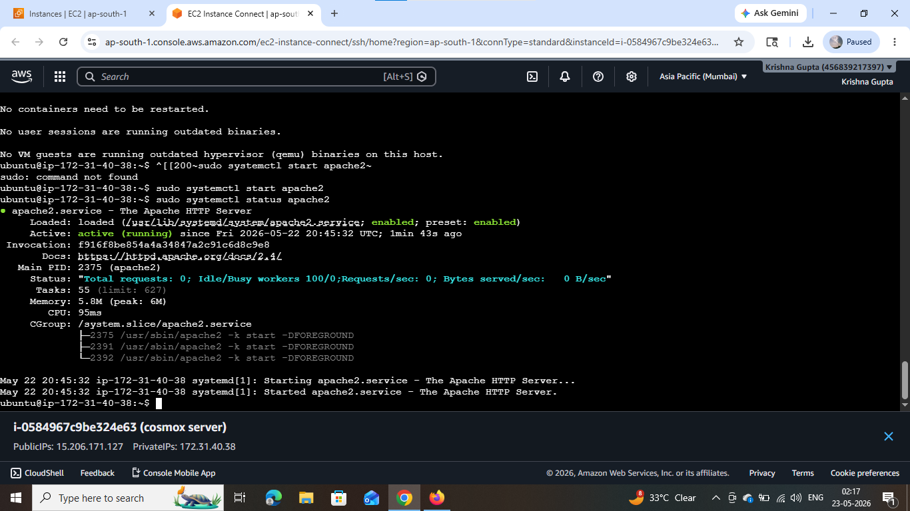

### Apache Default Page
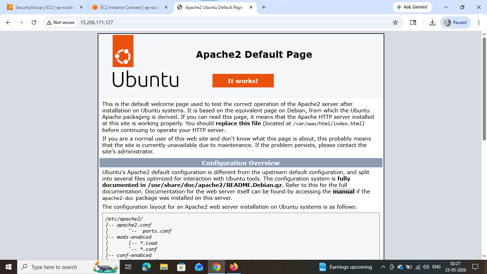

### File Transfer Debugging
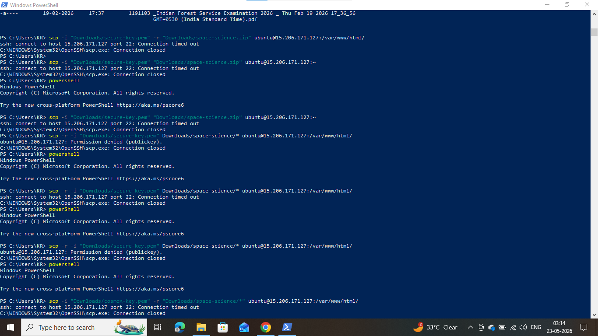

### Live Space Website Output
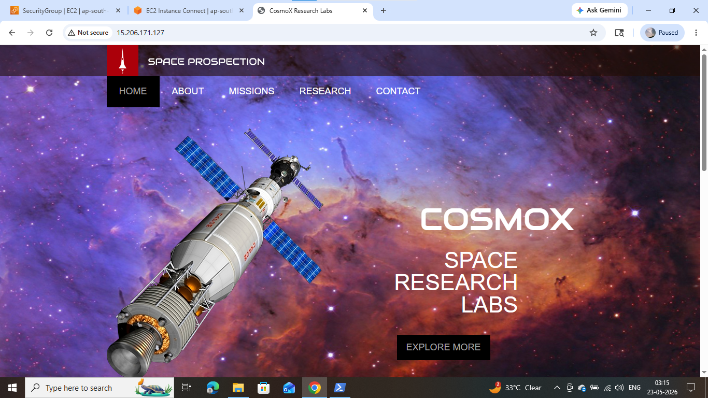

### Space Website Sections
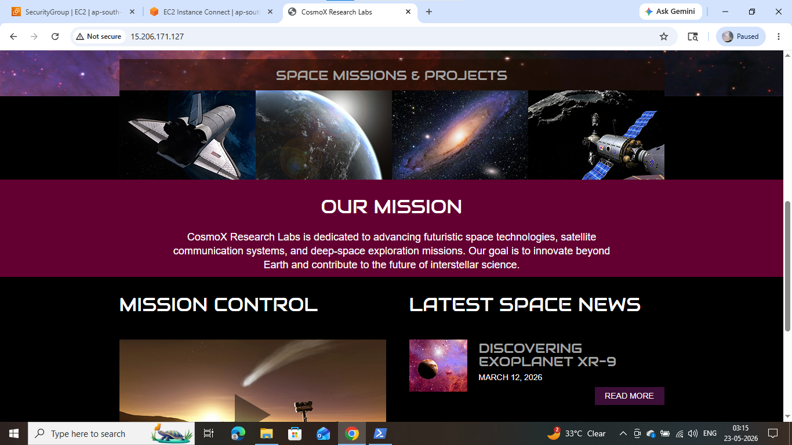

### Final Website Footer
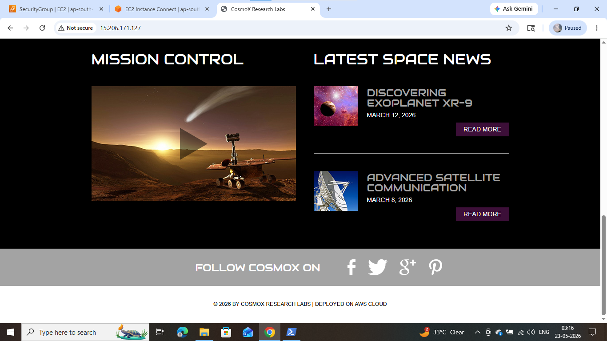
